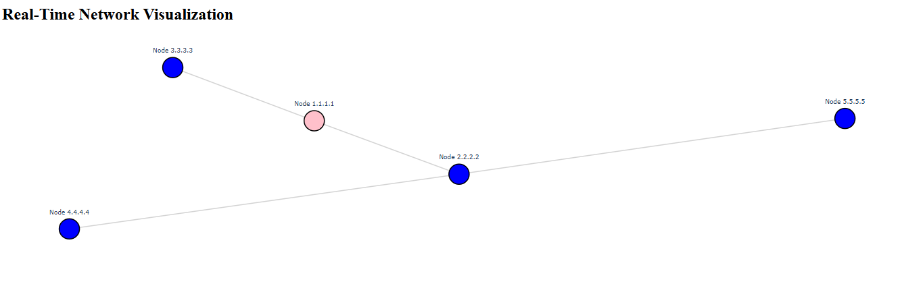

# Project Documentation

## Overview

This project implements a multihop routing protocol designed for devices such as ESP32 and NodeMCU. 
It autonomously builds and manages a self-constructed tree topology, handling all aspects of routing within the network.
The communication technology used is Wi-Fi.

## Table of Contents
1. [How to Run the Project](#how-to-run-the-project)
2. [Code Structure](#code-structure)
3. [Routing Protocol Documentation](#routing-protocol-documentation)
4. [Node Lifecycle (State Machine)](#node-lifecycle-state-machine)
5. [Logging](#logging)
6. [CLI](#cli)
7. [Visualization Program](#visualization-program)

## How to Run the Project
Provide instructions on how to set up the environment, dependencies, and the steps to run the project.

## Code Structure
Explain the general structure of the code, detailing the main modules and their roles in the project.

## Routing Protocol Documentation
### Overview
Provide an overview of the routing protocol, including how it operates within the network.
### Key Components
Detail the important components of the routing protocol and how they interact.
### Workflow
Describe the step-by-step workflow of the protocol, from initialization to route management.

## Node Lifecycle (State Machine)
Explain the node lifecycle, detailing the states each node can be in and the transitions between them.

## Logging
To facilitate debugging across different architectures (ESP devices, native environments, etc.), a unified logging module was developed. Since printing functions vary between architectures (e.g., `Serial.printf` for ESPs vs. `printf` for native platforms), this module abstracts logging to ensure consistency.

#### Log Categories
The logging system is divided into different log categories, each corresponding to a specific aspect of the system:

- **NETWORK** – Logs related to network events (e.g., new child node detected, successful network join, AP IP established).
- **MESSAGES** – Logs for sent and received messages.
- **STATE_MACHINE** – Logs tracking state transitions in the node's state machine.
- **DEBUG_SERVER** – Logs generated by the visualization server.

By default, all logging modules are **disabled**. To activate a specific logging module, call passing the desired module as an argument:

```c
enableModule(LogModules module);
```
#### Log Levels
In addition to categories, logs are classified by severity levels:

- **DEBUG** – Detailed logs for development and debugging (e.g., variable values).
- **INFO** – General informative logs (e.g., network state, IP addresses, number of children).
- **ERROR** – Critical errors that should not occur (e.g., invalid memory accesses).

#### Example Usage
To log an informational network event, use the `LOG` macro:
```c
LOG(NETWORK, INFO, "My STA IP: %s; Gateway: %s\n", getMySTAIP().toString().c_str(), getGatewayIP().toString().c_str());
```

## CLI
For debugging, development, and monitoring purposes, a Command Line Interface (CLI) has been implemented. 
To enter the CLI, simply press "Enter" in the serial monitor of the node you wish to monitor. 
Upon entering, a menu will be displayed with various options, such as visualizing the node’s routing and children tables or sending messages to other nodes within the network.

**Note**: When in CLI mode, the node becomes "locked" in this mode and will not respond to or receive any network messages.

**Tip**: In PlatformIO, to view the words you type in the serial monitor, press `[CTRL] + [T]` followed by `[CTRL] + [E]`.


## Visualization Program
A network visualization program was implemented in Python to provide real-time monitoring of the network topology. 
The program communicates with the root node via the serial monitor, reading and writing data to exchange information.

When the visualization program is active, nodes report all network changes to the root, including new nodes joining, nodes leaving, and parent changes. 
The root then relays this information to the visualization program, allowing for a dynamic, real-time representation of the network structure.



You can find the visualization program on GitHub: [Network Visualization Program](https://github.com/jequinhatavares/NetViz)