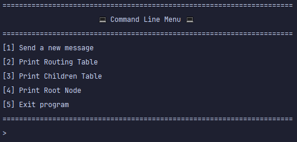

# Project Documentation

## Overview

This project implements a multihop routing protocol designed for devices such as ESP32 and NodeMCU. 
It autonomously builds and manages a self-constructed tree topology, handling all aspects of routing within the network.
The communication technology used is Wi-Fi.

## Table of Contents
1. [How to Run the Project](#how-to-run-the-project)
2. [Code Structure](#code-structure)
3. [Routing Protocol Documentation](#routing-protocol-documentation)
4. [Node Lifecycle (State Machine)](#node-lifecycle-state-machine)
5. [Logging](#logging)
6. [CLI](#cli)
7. [Visualization Program](#visualization-program)
8. [Unit Testing](#unit-testing)

## How to Run the Project

## Code Structure

## Routing Protocol Documentation
### Routing Table
### Children Table
### Messages
### Managing a Network
#### Parent Node Selection Process
#### Root Node
#### Parent Node Failure Handling Procedure 
#### Child Node Disconnection Handling Procedure

## Node Lifecycle (State Machine)


## Logging
To facilitate debugging across different architectures (ESP devices, native environments, etc.), a unified logging module was developed. Since printing functions vary between architectures (e.g., `Serial.printf` for ESPs vs. `printf` for native platforms), this module abstracts logging to ensure consistency.

#### Log Categories
The logging system is divided into different log categories, each corresponding to a specific aspect of the system:

- **NETWORK** – Logs related to network events (e.g., new child node detected, successful network join, AP IP established).
- **MESSAGES** – Logs for sent and received messages.
- **STATE_MACHINE** – Logs tracking state transitions in the node's state machine.
- **DEBUG_SERVER** – Logs related to communication with the visualization server.

By default, all logging modules are **disabled**. To activate a specific logging module, call passing the desired module as an argument:

```c
enableModule(LogModules module);
```
#### Log Levels
In addition to categories, logs are classified by severity levels:

- **DEBUG** – Detailed logs for development and debugging (e.g., variable values).
- **INFO** – General informative logs (e.g., network state, IP addresses, number of children).
- **ERROR** – Critical errors that should not occur (e.g., invalid memory accesses).

To set the current log level to debug, use the following line:
```cpp
currentLogLevel = DEBUG;
```

#### Example Usage
To log an informational network event, use the `LOG`:
```c
LOG(NETWORK, INFO, "My STA IP: %s; Gateway: %s\n", getMySTAIP().toString().c_str(), getGatewayIP().toString().c_str());
```

## CLI
For debugging, development, and monitoring purposes, a Command Line Interface (CLI) has been implemented. 
To enter the CLI, simply press "Enter" in the serial monitor of the node you wish to monitor. 
Upon entering, a menu will be displayed with various options, such as visualizing the node’s routing and children tables or sending messages to other nodes within the network.

<p align="center">
    

**Note**: When in CLI mode, the node becomes "locked" in this mode and will not respond to or receive any network messages.

**Tip**: In PlatformIO, to view the words you type in the serial monitor, press `[CTRL] + [T]` followed by `[CTRL] + [E]`.


## Visualization Program
A network visualization program was implemented in Python to provide real-time monitoring of the network topology. 
The program communicates with the root node via the serial monitor, reading and writing data to exchange information.

When the visualization program is active, nodes report all network changes to the root, including new nodes joining, nodes leaving, and parent changes. 
The root then relays this information to the visualization program, allowing for a dynamic, real-time representation of the network structure.


Visualization program GitHub: [Network Visualization Program](https://github.com/jequinhatavares/NetViz)

## Unit Testing

Several unit tests were developed to validate the libraries before testing the code on physical devices. These tests are currently executed on a computer, meaning there are no unit tests running directly on the boards. The following tests were implemented:

- **`test_circular_buffer`** – Verifies the correct functionality of the circular buffer, including inserting, deleting, and handling priority elements in the queue.
- **`test_lifecycle`** – Tests the parent selection function under various scenarios.
- **`test_logger`** – Ensures the logger module operates correctly on the computer, testing the variable argument handling (similar to printf).
- **`test_messages`** – Validates the encoding and decoding of different types of messages.
- **`test_routing_table`** – Evaluates multiple functionalities of the routing table. It verifies IP comparison logic, ensures correct printing of the routing and children tables, and tests adding, removing, and updating node entries. The test also checks table cleanup, correct pathfinding to different nodes (child, parent, or other network nodes), and handling invalid nodes. Additionally, it validates the initialization of the routing table on a new node through full routing updates and ensures partial updates modify the table correctly.
- **`test_state_machine`** – Ensures the state machine transitions correctly between states, considering the event queue.
- **`test_table`** – Tests the table implementation with different structure types used as keys and values (e.g., an IP address, structs).
- **`test_table_prealloc`** – Tests the table implementation using preallocated variables (e.g., global variables), which is useful for embedded systems.

These unit tests also serve as examples of how to use each implemented library.
