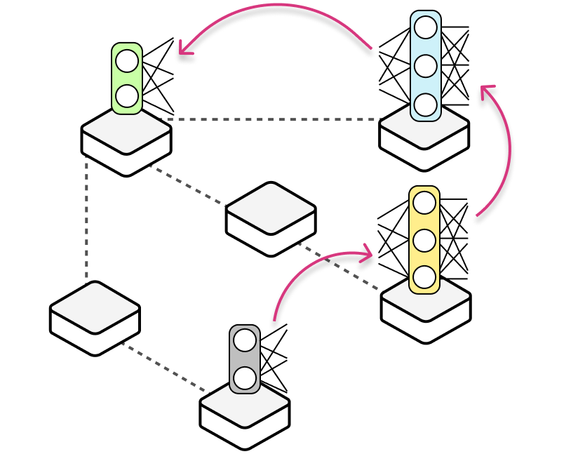
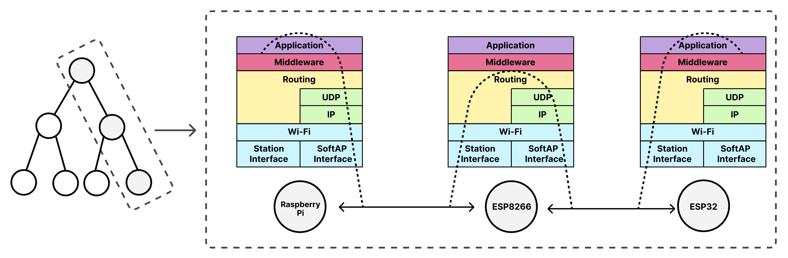
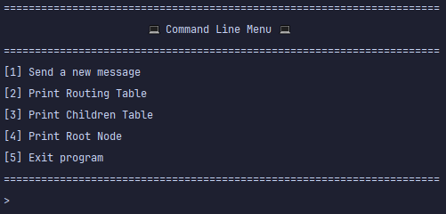
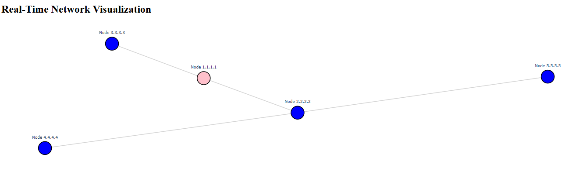

# HERMES Documentation

<p align="center">
  
</p>

## Overview

HERMES(Heterogeneous Application-Enabled Routing Middleware for Edge-IoT Systems) is a library built for ESP8266, ESP32, and Raspberry Pi based devices and is composed of two principal components. 
At its base, HERMES implements a multi-hop network on top of Wi-Fi. The library autonomously builds and manages a self-constructed tree topology, handling all aspects of routing within the network.

On top of this core network lies the second component, the middleware layer, which allows the application layer to define custom metrics and policies that tailor network behaviour to specific objectives.
This enables IoT applications to customise the network layer according to their goals and requirements.

For example, in edge computing applications, information about which nodes have higher processing capacity or are currently available for computation resides at the application layer. 
This information directly affects how data should be handled, since packets are required to be processed by nodes with these characteristics. 
HERMES enables this application-level knowledge to be taken into account during network formation and packet forwarding, for example by routing packets through intermediate processing nodes before they reach their final destination.



## Table of Contents
1. [How to Run the Project](#how-to-run-the-project)
2. [Code Structure](#code-structure)
3. [Routing Protocol Documentation](#routing-protocol-documentation)
4. [Node Lifecycle (State Machine)](#node-lifecycle-state-machine)
5. [Logging](#logging)
6. [CLI](#cli)
7. [Visualization Program](#visualization-program)
8. [Unit Testing](#unit-testing)

## How to Run the Project

The project was developed and tested using CLion IDE version 2024.1.6 together with PlatformIO version 6.1.18. 
However, the use of CLion is not mandatory. 
The project can also be built and uploaded using other IDEs, such as Visual Studio Code, by installing the PlatformIO plugin.
Once the code is opened in the IDE and the PlatformIO environment is correctly configured, simply upload the firmware to the target microcontroller. 
No additional steps are required and the project should run as expected.

The `Network` class is the main interface exposed by HERMES and is used to integrate a device into the network.  
A minimal example of how to initialise and run a node is shown below.

```cpp
#include "network.h"

Network network;

void setup() {
    network.setAsRoot(false);   // Set to true if this node is the root
    network.init();             // Initialise network parameters
    network.begin();            // Join and integrate the node into the network
}

void loop() {
    network.run();              // Must be called continuously
}
```

<table>
  <thead>
    <tr>
      <th>Function</th>
      <th>Description</th>
    </tr>
  </thead>
  <tbody>
    <tr>
      <td><code>setAsRoot(bool isRoot)</code></td>
      <td>Configures the node as a root or non-root node. This must be called before <code>begin()</code>.</td>
    </tr>
    <tr>
      <td><code>init()</code></td>
      <td>Initialises node parameters such as IP configuration, interfaces, and transport layer setup.</td>
    </tr>
    <tr>
      <td><code>begin()</code></td>
      <td>Integrates the node into the HERMES network and starts network operation.</td>
    </tr>
    <tr>
      <td><code>run()</code></td>
      <td>Executes the network logic and must be called repeatedly inside the main loop.</td>
    </tr>
    <tr>
      <td><code>stop()</code></td>
      <td>Terminates the node’s connection to the network and stops network operation.</td>
    </tr>
    <tr>
      <td><code>onDataReceived(callback)</code></td>
      <td>Registers a callback function to handle incoming data messages.</td>
    </tr>
    <tr>
      <td><code>onPeriodicAppTask(callback)</code></td>
      <td>Registers a periodic application-level task callback.</td>
    </tr>
    <tr>
      <td><code>onNetworkJoin(callback)</code></td>
      <td>Registers a callback triggered when the node joins the network.</td>
    </tr>
    <tr>
      <td><code>onChildConnect(callback)</code></td>
      <td>Registers a callback triggered when a new child node connects.</td>
    </tr>
  </tbody>
</table>


## Code Structure

The library is organised in a modular way to clearly separate responsibilities and simplify extension and maintenance.  
The main entry point for users of the library is the `network` class, defined in `network.h` and implemented in `network.cpp`.
This class represents the core interface through which an application integrates a node into the HERMES network.  
Users interact exclusively with this class to initialise the network, manage node behaviour, and exchange data.

The internal structure of the library is organised as follows:

<pre>
examples/                     # Usage examples and demos
src/
├── core/                     # Internal network implementation
│   ├── circular_buffer/      # Circular buffer implementation
│   ├── cli/                  # Command-line interface for debugging and control
│   ├── ip_tools/             # IP address utilities
│   ├── lifecycle/            # Node lifecycle management
│   ├── logger/               # Logging utilities
│   ├── middleware/           # Middleware Layer implementation
│   ├── network_monitoring/   # Network state and performance monitoring
│   ├── routing/              # Routing logic
│   ├── state_machine/        # State machine implementation
│   ├── table/                # Custom table implementation
│   ├── time_hal/             # Time abstraction layer
│   ├── transport_hal/        # Transport abstraction layer
│   └── wifi_hal/             # Wi-Fi hardware abstraction layer
├── network.cpp               # Network class implementation
└── network.h                 # Network class interface
</pre>

The `core` directory contains the internal building blocks of the system.  
Each submodule is responsible for a specific aspect of the network, such as routing, lifecycle management, middleware logic, transport abstraction, and hardware-specific functionality.  
These components are orchestrated internally by the `network` class, which abstracts the underlying complexity from the application layer.


## Routing Protocol Documentation
### Routing Table
Each node maintains a routing table that includes all nodes in the network (including itself), the next hop IP address to reach each node, 
and the hop distance to that node. When a packet arrives at a node, it is forwarded to the next hop IP specified in the corresponding routing table entry.

**Note**: All IPs in the routing tables are AP IPs

### Children Table
Each node also maintains a table that maps the AP IP address of each of its child nodes to their corresponding STA IP address. 
This is necessary because when the next hop for message forwarding is one of the node’s children, the STA IP must be used. 
Since the child is connected as a station within the parent’s network, it receives messages through its STA interface.

### Messages
### Managing a Network
#### Parent Node Selection Process
When a new node joins the network, it selects its parent based on two main criteria. 
First, it chooses the parent with the lowest hop count to the root node. 
If multiple potential parents share the same hop count, the node then selects the one with the fewest children, promoting a more balanced and evenly distributed network structure. 

#### Root Node
The root node is chosen manually by the user.

#### Parent Node Failure Handling Procedure 
#### Child Node Disconnection Handling Procedure

## Node Lifecycle (State Machine)


## Logging
To facilitate debugging across different architectures (ESP devices, native environments, etc.), a unified logging module was developed. 
Since printing functions vary between architectures (e.g., `Serial.printf` for ESPs vs. `printf` for native platforms), this module abstracts logging to ensure consistency.

#### Log Categories
The logging system is divided into different log categories, each corresponding to a specific aspect of the system:

- **NETWORK** – Logs related to network events (e.g., new child node detected, successful network join, AP IP established).
- **MESSAGES** – Logs for sent and received messages.
- **STATE_MACHINE** – Logs tracking state transitions in the node's state machine.
- **MONITORING_SERVER** – Logs related to communication with the visualization server.

By default, all logging modules are **disabled**. To activate a specific logging module, call passing the desired module as an argument:

```c
enableModule(LogModules module);
```
#### Log Levels
In addition to categories, logs are classified by severity levels:

- **DEBUG** – Detailed logs for development and debugging (e.g., variable values).
- **INFO** – General informative logs (e.g., network state, IP addresses, number of children).
- **ERROR** – Critical errors that should not occur (e.g., invalid memory accesses).

To set the current log level to debug, use the following line:
```cpp
currentLogLevel = DEBUG;
```

#### Example Usage
To log an informational network event, use the `LOG`:
```c
LOG(NETWORK, INFO, "My STA IP: %s; Gateway: %s\n", getMySTAIP().toString().c_str(), getGatewayIP().toString().c_str());
```

## CLI
For debugging, development, and monitoring purposes, a Command Line Interface (CLI) has been implemented. 
To enter the CLI, simply press "Enter" in the serial monitor of the node you wish to monitor. 
Upon entering, a menu will be displayed with various options, such as visualizing the node’s routing and children tables or sending messages to other nodes within the network.

<p align="center">
    

**Note**: When in CLI mode, the node becomes "locked" in this mode and will not respond to or receive any network messages.

**Tip**: In PlatformIO, to view the words you type in the serial monitor, press `[CTRL] + [T]` followed by `[CTRL] + [E]`.


## Visualization Program
A network visualization program was implemented in Python to provide real-time monitoring of the network topology. 
The program communicates with the root node via the serial monitor, reading and writing data to exchange information.

When the visualization program is active, nodes report all network changes to the root, including new nodes joining, nodes leaving, and parent changes. 
The root then relays this information to the visualization program, allowing for a dynamic, real-time representation of the network structure.



Visualization program GitHub: [Network Visualization Program](https://github.com/jequinhatavares/NetViz)

## Unit Testing

Several unit tests were developed to validate the libraries before testing the code on physical devices. These tests are currently executed on a computer, meaning there are no unit tests running directly on the boards. The following tests were implemented:

- **`test_circular_buffer`** – Verifies the correct functionality of the circular buffer, including inserting, deleting, and handling priority elements in the queue.
- **`test_lifecycle`** – Tests the parent selection function under various scenarios.
- **`test_logger`** – Ensures the logger module operates correctly on the computer, testing the variable argument handling (similar to printf).
- **`test_messages`** – Validates the encoding and decoding of different types of messages.
- **`test_routing_table`** – Evaluates multiple functionalities of the routing table. It verifies IP comparison logic, ensures correct printing of the routing and children tables, and tests adding, removing, and updating node entries. The test also checks table cleanup, correct pathfinding to different nodes (child, parent, or other network nodes), and handling invalid nodes. Additionally, it validates the initialization of the routing table on a new node through full routing updates and ensures partial updates modify the table correctly.
- **`test_state_machine`** – Ensures the state machine transitions correctly between states, considering the event queue.
- **`test_table`** – Tests the table implementation with different structure types used as keys and values (e.g., an IP address, structs).
- **`test_table_prealloc`** – Tests the table implementation using preallocated variables (e.g., global variables), which is useful for embedded systems.

These unit tests also serve as examples of how to use each implemented library.
